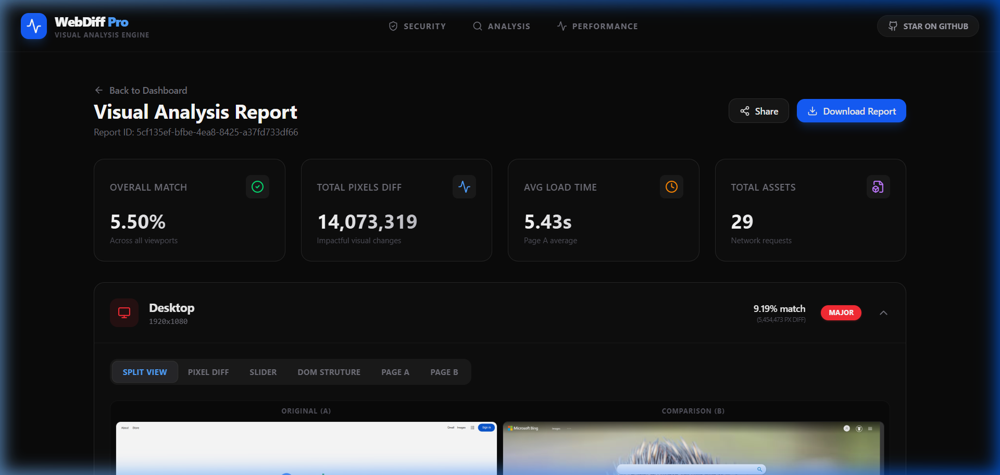
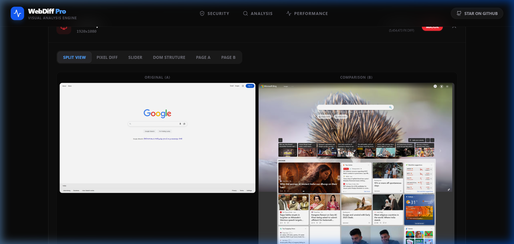

# WebDiff Pro - Full-Stack Web Comparison Engine




WebDiff Pro is a powerful, high-precision tool for comparing two web pages visually and structurally. It captures full-page screenshots at multiple resolutions, performs pixel-by-pixel diffing, analyzes the DOM tree for changes, and compares computed styles across versions.

## Features

- **Multi-Source Input**: Compare two URLs or upload local HTML files.
- **Precision Rendering**: Uses Playwright (Headless Chromium) to ensure modern JS, lazy loading, and dynamic content are fully rendered.
- **Visual Diff Suite**:
  - **Split View**: Side-by-side original vs comparison.
  - **Pixel Diff Map**: Highlighting exact changes in bright red.
  - **Interaction Slider**: Draggable overlay for real-time before/after comparison.
- **Structural Analysis**:
  - Interactive **DOM Tree** showing added, removed, and modified elements.
  - **Computed Style Diff**: Property-level comparison (font, color, spacing, padding, etc.).
- **Performance Insights**: Breakdown of load times, asset counts, and network resource lists.
- **Premium UI**: Modern dark dashboard with glassmorphism, smooth animations (Framer Motion), and responsive layout.

## Tech Stack

- **Frontend**: React 19, Vite, TypeScript, Tailwind CSS v4, Framer Motion, Lucide Icons.
- **Backend**: Node.js, Express, Playwright, pixelmatch, PNGjs, Cheerio.

## Setup Instructions

### Prerequisites
- Node.js (v18 or higher)
- npm or yarn

### 1. Server Setup
```bash
cd server
npm install
npx playwright install chromium
npm run dev
```
The server will start on `http://localhost:4000`.

### 2. Client Setup
```bash
cd client
npm install
npm run dev
```
The client will start on `http://localhost:5173` (or the next available port).

## Project Structure

- `/client`: React application containing the dashboard and report viewer.
- `/server`: Node.js Express server handling the playwright rendering and image processing.
- `/server/public/reports`: Temporary storage for generated screenshots and reports.

## Authors
Created by Madhurhita Ganguly.
